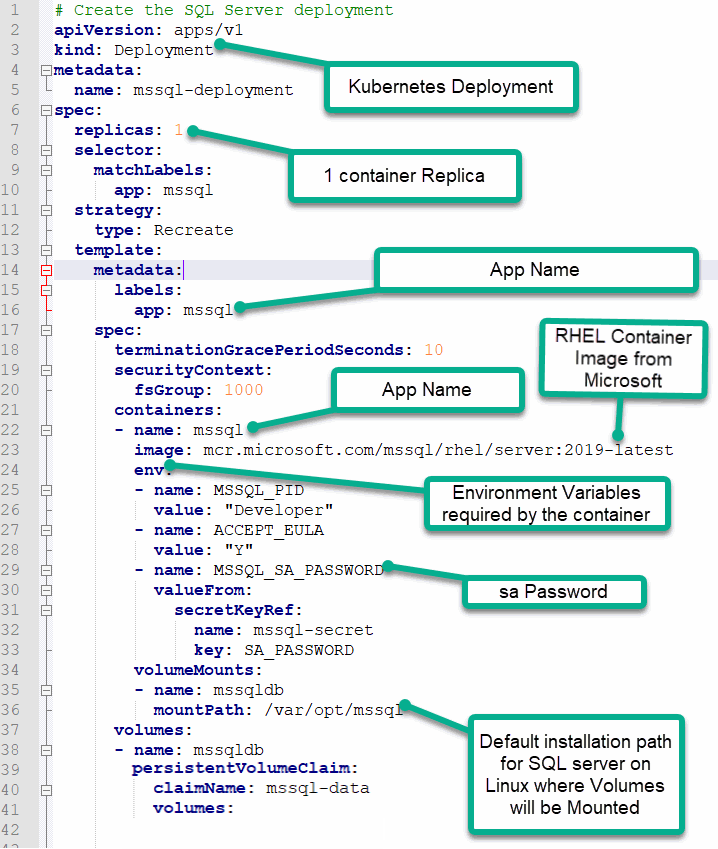

https://learn.microsoft.com/en-us/sql/linux/sql-server-linux-kubernetes-best-practices-statefulsets?view=sql-server-ver16
https://learn.microsoft.com/en-us/sql/linux/sql-server-linux-kubernetes-best-practices-statefulsets?view=sql-server-ver16

### Microsoft SQL Server is a relational database commonly used for business intelligence and analytics applications. Kubernetes, also called k8s, is an open-source platform that helps you deploy, configure, and update container-based software applications


### Deploying Microsoft SQL Server Linux Containers on EKS Kubernetes 

```sh
Deploying Microsoft SQL Server on EKS gives you the option to deploy and manage databases across multicloud or on-premises infrastructure. SQL Server can take advantage of built-in Kubernetes features, including high availability, security, and automatic resource scaling for demanding workloads. Running SQL Server in Kubernetes containers can help you optimize resources and reduce cost.

Introduction
This document provides a set of high-level instructions for using EKS Kubernetes to deploy Microsoft SQL Server Linux containers on Kubernetes. It covers the following topics:

1.	Storage management 
2.	SQL Server pod and container deployment
3.	Service configuration 
4.	SQL Server connection with sqlcmd and SQL Server Management Studio (SSMS)

kubectl cluster-info

### Microsoft SQL Server Container Deployment
To deploy a Microsoft SQL Server container on a Kubernetes cluster, complete the following steps:
1.	Create a namespace.
2.	Create secrets.
3.	Create a storage class.
4.	Create a persistent volume claim.
5.	Deploy the SQL Server container.
6. Connecting to the SQL Container and Verifying the Mount Points
7. Connecting to the SQL Server Instance
8. Create a database and database user
9. Using your SQL administrator permissions, create a new SQL user account for Confluence (for example, confluenceuser). 

### https://confluence.atlassian.com/doc/database-setup-for-sql-server-9258.html
### 1. Using your SQL administrator permissions, create a new database (for example confluence)
### 2. Set the default collation for the database to SQL_Latin1_General_CP1_CS_AS (case sensitive).  
### 3. Check the database isolation level of READ_COMMITTED_SNAPSHOT is ON.  

manifest deploy mssql pod in eks kubernetes, create database named onfluence with the following required database settings: 
ALLOW_SNAPSHOT_ISOLATION ON 
READ_COMMITTED_SNAPSHOT ON
READ_COMMITTED_SNAPSHOT ON WITH ROLLBACK IMMEDIATE
GLOBAL transaction_isolation='READ-COMMITTED'
Also, create user named confluence with password as confluence and grant full privileges to confluence user on the database


```sh

---
apiVersion: v1
kind: ConfigMap
metadata:
  name: mysql-initdb-config
data:
  init.sql: |
    USE master
    CREATE USER 'confluence'@'localhost' IDENTIFIED BY 'Sql2019isfast';
    CREATE DATABASE confluence;
    GRANT ALL PRIVILEGES ON confluence.* to 'confluence'@'localhost';
    CREATE DATABASE confluence CHARACTER SET utf8 COLLATE utf8_bin;
    ALTER DATABASE confluence COLLATE SQL_Latin1_General_CP1_CS_AS

    SELECT is_read_committed_snapshot_on FROM
    sys.databases WHERE name= 'confluence' 

    ALTER DATABASE confluence SET ALLOW_SNAPSHOT_ISOLATION ON;
    ALTER DATABASE confluence SET READ_COMMITTED_SNAPSHOT ON;
    ALTER DATABASE confluence SET READ_COMMITTED_SNAPSHOT ON WITH ROLLBACK IMMEDIATE;
    ALTER DATABASE confluence SET GLOBAL transaction_isolation='READ-COMMITTED';
    ALTER USER confluence WITH DEFAULT_SCHEMA = dbo
    FLUSH PRIVILEGES;
    SHOW GRANTS FOR 'confluence'@'localhost';
```

https://www.linkedin.com/pulse/inject-custom-scripts-k8s-pod-shafeeque-aslam/

```sh
kubectl create ns mssql
kubectl -n mssql create secret generic mssql-secret --from-literal=SA_PASSWORD="Sql2019isfast"

### Connect to the SQL Server using sqlcmd
sqlcmd -S mssql.solvweb.net -U sa -P Sql2019isfast

###  Open & access the container's shell
kubectl  -n mssql exec -it mssql-deployment-765b8fcfbd-m44tr -- /bin/bash
sqlcmd -S localhost -U sa -P Sql2019isfast
sqlcmd -S a97b717f982cc45338fac5ff58bd8b54-177577112.us-east-2.elb.amazonaws.com-U sa -P "Sql2019isfast"

kubectl port-forward mssql-deployment-765b8fcfbd-m44tr  1433:1433 -n mssql &
sqlcmd -S localhost -U sa -P Sql2019isfast

https://medium.com/ms-sql-server-containers/create-and-setup-ms-sql-server-database-docker-containers-2422f757464d



################################################

USE master
GO
IF NOT EXISTS (
   SELECT name
   FROM sys.databases
   WHERE name = N'confluence'
)
CREATE DATABASE [confluence]
GO

CREATE DATABASE confluence

### List databases
SELECT name
FROM sys.databases;

### Create Database in SQL Server 
USE master;
CREATE DATABASE confluence;

### Create user
CREATE LOGIN confluence WITH PASSWORD = 'confluence';
CREATE USER 'bob'@'10.1.1.1' IDENTIFIED BY 'password123';

### 
GRANT ALL PRIVILEGES ON *.* TO 'sammy'@'localhost' WITH GRANT OPTION;
GRANT ALL ON *.* TO 'janet'@'localhost' WITH GRANT OPTION;
GRANT ALL PRIVILEGES ON database_name.* TO 'username'@'localhost';
################################################


brew install mssql-cli   
brew install --cask sqlcl

mssql-cli -S 'server Name'  -U 'user name'

########################################################################

jdbc:sqlserver://18.116.43.12:1433;databaseName=confluence
confluence
confluence

https://confluence.solvweb.net/
https://jira.solvweb.net/

swilliams
swilliams

########################################################################

kubectl apply -f pv.yaml
kubectl apply -f pvc.yaml
kubectl apply -f deployment.yaml

kubectl get po -n mssql 
kubectl get svc -n mssql 
kubectl get ing -n mssql 
kubectl get all -n mssql 
kubectl get events -n mssql 
kubectl describe pod mssql-deployment-c7f8b77b-pj8k5 -n mssql  

kubectl delete -f ./
### Connect to SQL Server using SQLCMD
### Connect Microsoft SQL Server & Kubernetes

This step creates a Kubernetes deployment object to create the container that hosts the SQL Server instance. The deployment object creates a replica set and pod.

- It creates a manifest (a YAML file) to describe the deployment configurations.
- It uses the mssql-server-linux docker image for SQL Server installation.
- It retrieves the SA password from the mssql secret created earlier using kubectl.
- Specify the SQL Server edition using the MSSQL_PID. Currently, we set it as Developer. You can choose the values such as Express, Standard, Enterprise ( for production license)
- The deployment uses the persistentVolumeClaim – mssql-data as defined earlier.
- The script defines port 1433 for SQL Server connections.


### MAC 
https://builtin.com/software-engineering-perspectives/sql-server-management-studio-mac
sudo docker pull mcr.microsoft.com/mssql/server:2022-latest
docker run -d --name sql_server_test -e 'ACCEPT_EULA=Y' -e 'SA_PASSWORD=dockerStrongPwd123' -p 1433:1433 mcr.microsoft.com/mssql/server:2022-latest
mssql -u sa -p dockerStrongPwd123
```

https://www.pythian.com/blog/technical-track/running-sql-server-2019-on-google-kubernetes-engine


################################################


################################################


```sql
wait for the SQL Server to come up
sleep 30s

echo "running set up script"
#run the setup script to create the DB and the schema in the DB
/opt/mssql-tools/bin/sqlcmd -S localhost -U sa -P sa@Passw0rd -d master -i ankara-db-init.sql

/opt/mssql-tools/bin/sqlcmd -S localhost -U sa -P yourStrong(!)Password -d master -i create-database.sql

### Reset MSSQL root password
sudo systemctl stop mssql-server
sudo systemctl status mssql-server
/opt/mssql/bin/mssql-conf set-sa-password
sudo systemctl start mssql-server
sudo systemctl status mssql-server
```